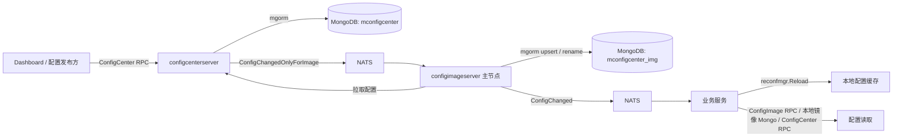
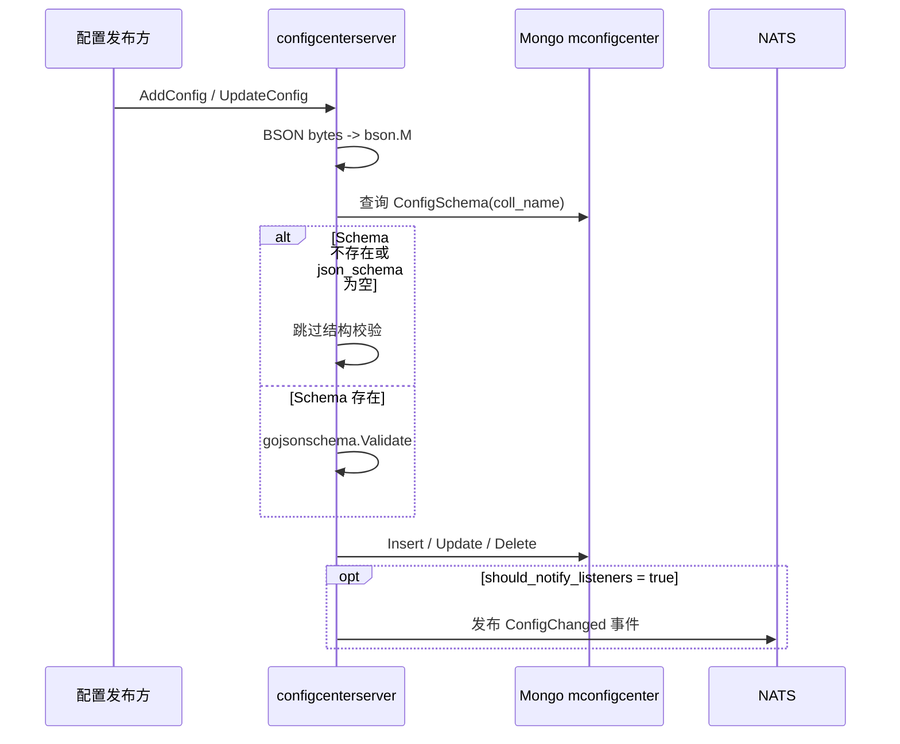

# mconfigcenter 技术介绍文档

`mconfigcenter` 是一个基于 `easymicro`、`mgorm`、MongoDB、NATS 和 `reconfmgr` 构建的配置中心。它的核心目标不是只做简单的 key-value 配置，而是支持以 Mongo 集合为粒度管理复杂业务配置，并通过 JSON Schema、索引定义、配置镜像和变更通知机制，适配大型业务中多类型、多集合、多监听组的配置发布与热重载场景。

项目还提供了一个 Web 面板集成项目：

https://github.com/995933447/mconfigcenter-dashboard.git

## 核心定位

`mconfigcenter` 把配置拆成两类能力：

| 能力 | 说明                                                                                           |
| --- |----------------------------------------------------------------------------------------------|
| 复杂集合配置 | 每类业务配置对应一个 Mongo collection，配置内容以 BSON bytes 传输，以 JSON Schema 做结构校验，支持索引和唯一索引。适合管理内容结构复杂的配置。 |
| 通用 KV 配置 | 固定存储在 `kv_config` 集合中，`key` 唯一，`value` 为字符串，可承载普通字符串或 JSON 结构体。                              |
| 配置 Schema | 每个配置集合可注册 `ConfigSchema`，描述集合名、普通索引、唯一索引、JSON Schema 和说明。                                    |
| 配置镜像 | `configimageserver` 可作为只读配置镜像层，业务服务优先读取镜像库，降低配置中心主服务的读压力。                                    |
| 变更通知 | 配置变更后通过 NATS 事件广播，业务服务可按 listener group 过滤并触发 `reconfmgr.Reload`。                            |
| 代码生成 | 基于 proto 扩展生成 gRPC、easymicro client/server、mgorm ORM、JSON Schema 和 mconfig schema 输出代码。      |

## 总体架构



在默认推荐的 `throughImageServer` 模式下，配置中心先通知镜像服务，镜像服务完成同步后再通知业务监听者。这样业务侧读取的是镜像层，配置中心主服务主要承担写入、Schema 管理和发布控制面职责。

也可以使用 `direct` 模式，让 `configcenterserver` 直接发布业务侧重载事件，适合规模较小或不需要镜像隔离的部署。

## 目录结构

| 路径 | 说明 |
| --- | --- |
| `proto/` | 配置中心、配置镜像和公共 KV 配置的 proto 定义。 |
| `common/` | 公共配置结构和 generated mgorm/jsonschema 代码，主要是 `KVConfig`。 |
| `configcenter/` | ConfigCenter 的 generated gRPC client、mgorm model、事件定义和业务接入辅助函数。 |
| `configcenterserver/` | 配置中心服务端，负责配置写入、Schema 管理、KV 管理和变更事件发布。 |
| `configimage/` | ConfigImage 的 generated gRPC client。 |
| `configimageserver/` | 配置镜像服务端，负责订阅中心变更、同步镜像库、对外提供只读查询。 |
| `mconfigschema/` | 由 `protoc-gen-mconfigschemaoutput` 生成的配置中心 Schema JSON。 |
| `jsonschema/` | 由 `protoc-gen-easymicro-jsonschema` 生成的 JSON Schema 输出。 |
| `protoc-gen/protoc-gen-mconfigschemaoutput/` | 自定义 protoc 插件，用于生成配置中心可消费的 Schema 输出程序。 |
| `easymicro_loader/` | Mongo、NATS、Redis、Etcd、Discovery 等基础组件配置样例。 |
| `example/` | 业务服务接入示例，演示 KV 配置注册、读取和热重载。 |

## 核心服务

### ConfigCenter

`ConfigCenter` 是配置中心的写入和控制面服务，proto 定义在 `proto/configcenter.proto`，服务发现默认名为 `mconfigcenter`，gRPC schema 为 `mconfigcenter`。

| RPC | 职责 |
| --- | --- |
| `AddConfig` | 向指定配置集合新增一条 BSON 配置。 |
| `AddConfigs` | 向指定配置集合批量新增 BSON 配置。 |
| `UpdateConfig` | 按 `_id` 更新指定集合中的一条配置。 |
| `UpdateConfigs` | 按多个 `_id` 批量更新同一个配置内容。 |
| `DeleteConfig` | 按 `_id` 删除指定集合中的一条配置。 |
| `DeleteConfigs` | 按多个 `_id` 批量删除指定集合中的配置。 |
| `ListConfig` | 查询指定集合，支持 BSON filter、排序、字段选择、分页和总数统计。 |
| `NotifyListenersReloadConfig` | 主动广播重载事件，可指定集合列表或全量重载。 |
| `SetConfigSchema` | 注册或更新配置集合 Schema，并创建对应 Mongo 索引。 |
| `GetConfigSchema` | 根据集合名查询 Schema。 |
| `ListConfigSchema` | 查询全部已注册 Schema。 |
| `SetKeyValue` | 新增或更新 KV 配置。 |
| `GetKeyValue` | 根据 key 查询 KV 配置。 |

### ConfigImage

`ConfigImage` 是配置镜像服务，proto 定义在 `proto/configimage.proto`。它只暴露查询类接口，不负责发布配置：

| RPC | 职责 |
| --- | --- |
| `ListConfig` | 从镜像 Mongo 查询指定配置集合。 |
| `GetKeyValue` | 从镜像 Mongo 查询 `kv_config` 中的 key。 |

镜像服务启动时会初始化 Redis、选主、Mongo 和 gRPC。只有主节点会订阅配置中心发给镜像层的事件，避免多实例重复同步。

## 数据模型

### ConfigSchema

`ConfigSchema` 存储在 MongoDB：

| 字段 | 类型 | 说明 |
| --- | --- | --- |
| `coll_name` | string | 配置集合名称，也是 Schema 唯一键。 |
| `index_keys` | repeated string | 普通索引字段。 |
| `uniq_index_keys` | repeated string | 唯一索引字段。 |
| `json_schema` | string | 用于写入校验的 JSON Schema 文本。 |
| `desc` | string | 配置集合说明。 |

mgorm 生成代码中默认：

| 项 | 值 |
| --- | --- |
| Mongo connection | `mconfigcenter` |
| database | `mconfigcenter` |
| collection | `config_schema` |
| unique index | `coll_name` |

### KVConfig

`KVConfig` 存储在 MongoDB 的 `kv_config` 集合：

| 字段 | 类型 | 说明 |
| --- | --- | --- |
| `key` | string | 配置键，唯一。 |
| `value` | string | 配置值，可为普通字符串，也可为 JSON 字符串。 |
| `extra` | string | 额外信息，用于备注、扩展元数据等。 |

mgorm 生成代码中默认：

| 项 | 值 |
| --- | --- |
| Mongo connection | `mconfigcenter` |
| database | `mconfigcenter` |
| collection | `kv_config` |
| unique index | `key` |

## 写入与校验流程

复杂集合配置的写入流程如下：



实现要点：

| 步骤 | 说明 |
| --- | --- |
| BSON 解析 | `AddConfig`、`AddConfigs`、`UpdateConfig`、`UpdateConfigs` 都要求 `value` 是可被 `bson.Unmarshal` 解析的 BSON bytes。 |
| `_id` 处理 | 新增时如果没有 `_id` 会自动生成 `primitive.ObjectID`；如果 `_id` 不是有效 hex，也会重新生成。更新时会删除传入内容中的 `_id`，避免修改主键。 |
| 时间字段 | 新增时写入 `created_at`、`updated_at`；更新时写入 `updated_at`。 |
| Schema 校验 | 若集合已注册 `json_schema`，写入前使用 `gojsonschema` 校验。 |
| 空数组/对象兼容 | 校验错误中如果是 `null` 与 `array/object/map` 的类型差异，当前实现会过滤这类错误，避免可选复杂字段为空时被拦截。 |
| 索引创建 | `SetConfigSchema` 会 upsert Schema，并按 `index_keys`、`uniq_index_keys` 调用 mgorm 创建索引；可同步创建，也可异步创建。 |

## 查询协议

`ListConfig` 和 `ConfigImage.ListConfig` 都使用同一套查询结构：

| 字段 | 说明 |
| --- | --- |
| `coll_name` | 必填，Mongo 集合名。 |
| `offset` | 分页偏移。 |
| `limit` | 分页数量；当 `offset` 和 `limit` 都为 0 时查询全部。 |
| `sorts` | 排序字段列表，`sort_way` 为 `1` 或 `-1`。 |
| `filter` | BSON bytes，服务端会按 `bson.Unmarshal` 解析。 |
| `selectors` | 字段选择，值通常为 `1` 或 `0`。 |

返回的 `list` 也是 BSON bytes，调用方需要按业务结构或 `bson.M` 反序列化。

示例：

```go
filter := bson.M{"status": 1}
filterBytes, _ := bson.Marshal(filter)

resp, err := configcenter.ConfigCenterGRPC().ListConfig(ctx, &configcenter.ListConfigReq{
    CollName: "activity_rule",
    Offset:   0,
    Limit:    50,
    Filter:   filterBytes,
    Sorts: []*configcenter.ListConfigReq_Sort{
        {Field: "updated_at", SortWay: -1},
    },
})
```

## 变更通知与热重载

配置变更事件定义在 `configcenter/configcenter_event.go`：

| 事件名 | 说明 |
| --- | --- |
| `configcenter.ConfigChangedOnlyForImage` | 配置中心发给镜像服务的事件。 |
| `configcenter.ConfigChanged` | 发给业务监听者的配置变更事件。 |

事件体：

| 字段 | 说明 |
| --- | --- |
| `configs` | 变更集合列表，每个元素包含 `coll_name` 和 `config_ids`。 |
| `refresh_listener_group` | 监听组。业务或镜像服务只处理匹配自己 listener group 的事件。 |
| `should_reload_all` | 是否全量重载。为 true 时业务侧使用 `*` 触发全量 reload，镜像侧会枚举全部集合并同步。 |

### throughImageServer 模式

`configcenterserver` 的 `listener_notification_direct` 配置为 `throughImageServer` 时：

1. 配置中心写入主库。
2. 配置中心发布 `ConfigChangedOnlyForImage`。
3. 镜像服务主节点收到事件。
4. 镜像服务从配置中心拉取变更配置。
5. 镜像服务写入自己的 Mongo 镜像库。
6. 镜像服务发布 `ConfigChanged`。
7. 业务服务收到事件并执行 `reconfmgr.Reload`。

### direct 模式

`listener_notification_direct` 配置为 `direct` 或非 `throughImageServer` 时：

1. 配置中心写入主库。
2. 配置中心直接发布 `ConfigChanged`。
3. 业务服务收到事件并重载。

## ConfigImage 同步策略

镜像服务在 `OnConfigChangedEvent` 中处理配置同步：

| 场景 | 行为 |
| --- | --- |
| 指定 `config_ids` | 按 `_id in config_ids` 从 ConfigCenter 拉取，写入镜像库时使用 `_id` upsert。 |
| 指定集合但没有 `config_ids` | 对该集合执行全量同步。 |
| `should_reload_all = true` | 枚举镜像库中的全部集合，并逐集合全量同步。 |

全量同步时，镜像服务会：

1. 创建临时集合：`<coll_name>_temp_<timestamp>`。
2. 按 `_id` 升序分页从配置中心拉取数据。
3. 将配置批量写入临时集合。
4. 使用 Mongo admin `renameCollection` 将临时集合覆盖为正式集合。

这种方式可以降低全量同步期间读到半成品数据的风险，但 Mongo 用户需要具备执行 `renameCollection` 和 `dropTarget` 的权限。

## 业务接入 KV 配置

项目提供了面向业务服务的 KV 配置接入封装，推荐流程如下：

```go
func LoadConfigHub(listenerGroup string) error {
    if err := configcenter.InitReconfmgrReloader(listenerGroup); err != nil {
        return err
    }

    if err := configcenter.RegisterKVConfig(
        999,
        nil,
        "",
        "",
        configcenter.KVConfigDataSrcConfigImage,
    ); err != nil {
        return err
    }

    RegisterVipLevelMaxConfig()
    return nil
}
```

`RegisterKVConfig` 支持三种数据源：

| 数据源 | 说明 |
| --- | --- |
| `KVConfigDataSrcLocalImage` | 直接从本地 Mongo 镜像库读取 `kv_config`。 |
| `KVConfigDataSrcConfigImage` | 通过 ConfigImage RPC 读取，适合业务服务不直连镜像 Mongo 的情况。 |
| `KVConfigDataSrcConfigCenter` | 直接通过 ConfigCenter RPC 读取，适合没有部署镜像层的情况。 |

### 泛型子配置

业务可以基于 `KVSubConfigWrapper[T]` 把 KV 的 JSON 字符串解析成类型化配置：

```go
type VipLevelMax struct {
    MaxLevel int `json:"max_level"`
}

type VipLevelMaxConfig struct {
    configcenter.KVSubConfigWrapper[VipLevelMax]
}

func RegisterVipLevelMaxConfig() {
    cfg := &VipLevelMaxConfig{}
    cfg.Key = "VipLevelMax"
    cfg.InitConfig = func(config *VipLevelMax) {
        if config.MaxLevel < 20 {
            config.MaxLevel = 20
        }
    }
    configcenter.RegisterKVSubConfig(cfg.Key, cfg)
}
```

读取时：

```go
cfg, ok, err := generalkv.MustGetVipLevelMaxConfig().GetConfig()
if err != nil {
    return err
}
if ok {
    level := cfg.MaxLevel
    _ = level
}
```

当配置变更事件触发 `reconfmgr.Reload` 后，`KVConf.LoadConfig` 会重载 KV map，并调用 `ReloadKVSubConfig` 清理子配置缓存。下一次 `GetConfig` 会重新从 KV map 解析配置。

## 代码生成链路

`gen_rpc.sh` 是主代码生成脚本：

```bash
./gen_rpc.sh configcenter
./gen_rpc.sh configimage
./gen_rpc.sh common
```

它会调用：

| 插件 | 产物 |
| --- | --- |
| `protoc-gen-go` | `*.pb.go` |
| `protoc-gen-go-grpc` | `*_grpc.pb.go` |
| `protoc-gen-easymicro-client` | easymicro gRPC client 封装 |
| `protoc-gen-easymicro-server` | easymicro server 注册和 handler 骨架 |
| `protoc-gen-mgorm` | Mongo ORM model、索引、缓存 key、基础 CRUD |
| `protoc-gen-easymicro-jsonschema` | `jsonschemaoutput/*/*.go` 和 `jsonschema/*/*.json` |
| `protoc-gen-mconfigschemaoutput` | `mconfigschemaoutput/*/*.go` 和 `mconfigschema/*/*.json` |

`mconfigschema` 的输出格式包含：

| 字段 | 说明 |
| --- | --- |
| `table` | mgorm 配置里的表名，也就是 Mongo collection。 |
| `index_keys` | 普通索引字段。 |
| `uniq_index_keys` | 唯一索引字段。 |
| `json_schema` | 根据 ORM struct 反射出的 JSON Schema。 |
| `desc` | mgorm options 中的描述。 |

这份 JSON 可以作为 `SetConfigSchema` 的输入来源，用于注册配置集合协议。

## 自定义业务配置集合

新增复杂配置集合时，推荐流程：

1. 在业务 proto 中定义配置 message。
2. 给 message 添加 `mgorm_ext.mgorm_opts`，声明 `conn`、`db`、`tb`、索引和说明。
3. 给字段添加 `mgorm_ext.mgorm_field_opts`，写入 `json`、`bson`、`jsonschema` tags。
4. 执行代码生成脚本。
5. 将生成的 `mconfigschema/<package>/*.json` 注册到配置中心。
6. 通过 Dashboard 或 ConfigCenter RPC 添加配置。
7. 业务服务通过 ConfigImage 或本地镜像读取配置，并订阅变更事件。

示意 proto：

```proto
message ActivityRule {
  option (easymicro_ext.json_schema_output_opts) = {
    field_name_tag:"bson"
  };
  option (mgorm_ext.mgorm_opts) = {
    conn:"mconfigcenter"
    db:"mconfigcenter"
    tb:"activity_rule"
    disabled_auto_expire_at:true
    uniq_index_keys:["rule_id"]
    desc: "活动规则配置"
  };

  string rule_id = 1 [(mgorm_ext.mgorm_field_opts)= {tags:"json:\"rule_id\" bson:\"rule_id\" jsonschema:\"title=规则ID\""}];
  string name = 2 [(mgorm_ext.mgorm_field_opts)= {tags:"json:\"name\" bson:\"name\" jsonschema:\"title=规则名称\""}];
}
```

## 服务启动与配置

### configcenterserver

启动流程：

1. `boot.InitNode("configcenter")`
2. `config.LoadConfig()`
3. `boot.InitMgorm()`
4. `event.RegisterEventListeners()`
5. 非生产环境注册 NATS RPC 路由
6. 初始化 gRPC discovery
7. 启动 gRPC server 和健康检查

配置文件：`configcenterserver/easymicro_loader/configcenterserver.json`

| 字段 | 说明 |
| --- | --- |
| `env` | 环境：`dev`、`test`、`prod`。 |
| `listener_notification_direct` | 监听者通知方式，`throughImageServer` 表示先同步镜像，再通知业务。 |
| `mongo_db` | 配置中心 Mongo database，空值默认 `mconfigcenter`。 |
| `mongo_conn` | Mongo connection 名，空值默认 `mconfigcenter`。 |
| `pub_notification_nats_conn` | 发布通知使用的 NATS connection，空值默认 `default`。 |
| `discovery_name` | 服务发现名，空值默认 `mconfigcenter`。 |

### configimageserver

启动流程：

1. `boot.InitNode("configimage")`
2. `config.LoadConfig()`
3. `boot.InitRouteredis()`
4. `boot.InitElect()`
5. `boot.InitMgorm()`
6. 主节点注册 NATS 事件监听
7. 初始化自身 ConfigImage discovery
8. 初始化 ConfigCenter gRPC client
9. 启动 gRPC server 和健康检查

配置文件：`configimageserver/easymicro_loader/configimageserver.json`

| 字段 | 说明 |
| --- | --- |
| `env` | 环境：`dev`、`test`、`prod`。 |
| `mongo_db` | 镜像 Mongo database，空值默认 `mconfigcenter_img`。 |
| `mongo_conn` | 镜像 Mongo connection 名，空值默认 `mconfigcenter_img`。 |
| `listener_group` | 镜像服务处理的监听组，必须和发布事件中的 listener group 匹配。 |
| `sub_notification_nats_conn` | 订阅通知使用的 NATS connection，空值默认 `default`。 |
| `sub_notification_max_ack_wait_sec` | NATS ack 最大等待时间。 |
| `sub_notification_nats_idle_heartbeat` | NATS idle heartbeat。 |
| `discovery_name` | ConfigImage 服务发现名，空值默认 `mconfigcenter_img`。 |
| `config_center_discovery_name` | ConfigCenter 服务发现名，空值默认 `mconfigcenter`。 |

基础组件配置位于 `easymicro_loader/`：

| 文件 | 说明 |
| --- | --- |
| `mongo.json` | 定义 `mconfigcenter` 和 `mconfigcenter_img` 两个 Mongo connection。 |
| `nats.json` | 定义通知事件使用的 NATS connection。 |
| `redis.json` | 镜像服务选主依赖 Redis。 |
| `etcd.json` | discovery 使用的 Etcd connection。 |
| `discovery.json` | easymicro 服务发现配置。 |
| `protogen.json` | 代码生成插件配置。 |

## 错误码

| 错误码 | 说明 |
| --- | --- |
| `ErrCodeNil = 0` | 无错误。 |
| `ErrCodeParamInvalid = 1001` | 参数非法。 |
| `ErrCodeConfigSchemaNotFound = 1002` | 配置 Schema 不存在。 |
| `ErrCodeValidateSchemaFailed = 1003` | JSON Schema 校验失败。 |
| `ErrCodeConfigNotFound = 1004` | 配置不存在。 |

## 当前实现注意事项

| 事项 | 说明 |
| --- | --- |
| `AddConfigResp.config_id` 和 `AddConfigsResp.config_ids` | 当前 handler 内部生成了 id 并用于事件通知，但响应字段尚未回填。调用方如果依赖新增 id，需要后续修正实现或通过查询获得。 |
| `GetKeyValueResp.id` | proto 中有 `id` 字段，但当前 `GetKeyValue` handler 未回填。 |
| `UpdateConfigs` | 多个 id 共用同一个 `value`，不是每条配置分别传一个 value。 |
| `filter` 格式 | `ListConfigReq.filter` 是 BSON bytes，不是 JSON 字符串 bytes。 |
| `coll_name` | 写入、更新、删除、查询都应显式传入集合名。部分 handler 对空集合名校验不完全，客户端侧需要保证正确。 |
| Schema 缺失 | 未注册 Schema 或 `json_schema` 为空时，写入不会做结构校验。 |
| 镜像全量同步权限 | `syncConfigAll` 使用 Mongo admin `renameCollection`，部署账号需要相关权限。 |
| 镜像增量删除 | 指定多个 `config_ids` 同步时，如果中心返回为空会批量删除这些 id；如果只返回其中一部分，当前逻辑只 upsert 返回项，未返回的缺失 id 不会在该轮被删除。批量删除场景需要关注这一点。 |

## 推荐部署方式

生产环境建议采用：

1. 一个或多个 `configcenterserver` 实例，负责配置写入和 Schema 管理。
2. 一个或多个 `configimageserver` 实例，使用 Redis/elect 选主，主节点订阅中心事件并同步镜像。
3. 业务服务优先从 ConfigImage 或本地镜像 Mongo 读取配置。
4. 配置发布时带上合适的 `listener_group`，避免无关业务重复重载。
5. 对复杂集合先注册 Schema 和索引，再开放写入。
6. 对需要立即生效的配置设置 `should_notify_listeners = true`；批量发布时可以先写入，再调用 `NotifyListenersReloadConfig` 统一通知。

## 适用场景

`mconfigcenter` 适合：

| 场景 | 原因 |
| --- | --- |
| 活动规则、等级规则、风控规则等复杂配置 | 支持对象、数组和自定义字段结构，可用 JSON Schema 校验。 |
| 多业务线共享配置中心 | 配置集合按 collection 隔离，listener group 控制重载范围。 |
| 配置读多写少 | 镜像服务可承担读侧压力，主配置中心保持控制面职责。 |
| 需要配置热重载 | NATS 事件和 `reconfmgr` 能把变更传播到业务本地缓存。 |
| 希望从 proto 生成配置协议 | mgorm/jsonschema/mconfigschemaoutput 插件可以减少手写 Schema 和 ORM 代码。 |

## 后续可优化方向

1. 回填新增配置和 KV 查询响应中的 id 字段。
2. 为 `UpdateConfig`、`DeleteConfig` 等接口补齐 `coll_name` 参数校验。
3. 增强镜像增量同步删除语义，处理部分 id 已删除、部分仍存在的混合场景。
4. 为配置发布增加版本号、发布人、灰度状态和审计日志。
5. 为 `SetConfigSchema` 增加 Schema 合法性预校验，避免无效 JSON Schema 入库。
6. 为 `ListConfig` 增加 JSON filter 兼容层，降低 Dashboard 或运维脚本调用门槛。
7. 为关键 handler 增加单元测试和集成测试，覆盖 Schema 校验、事件发布、镜像同步和 KV 重载。
